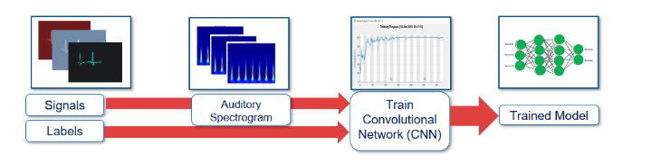
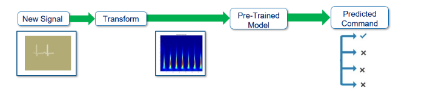
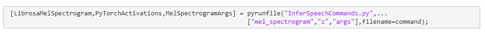
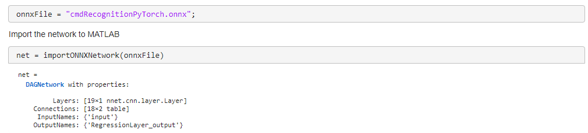
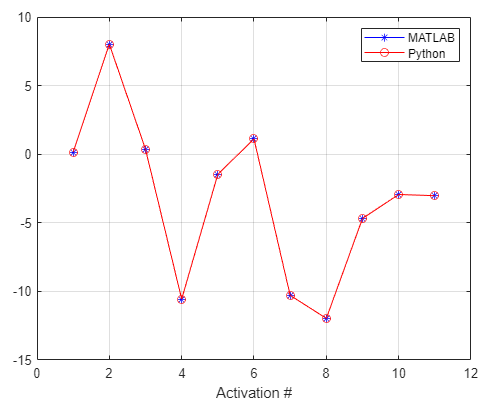
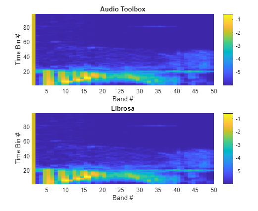
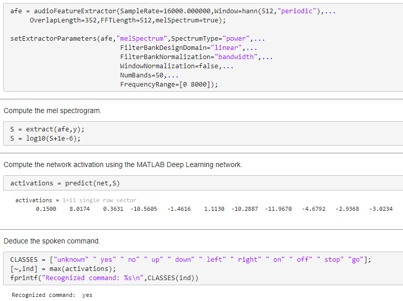
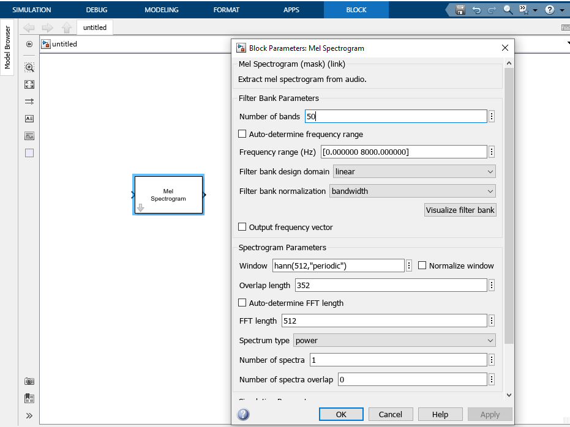
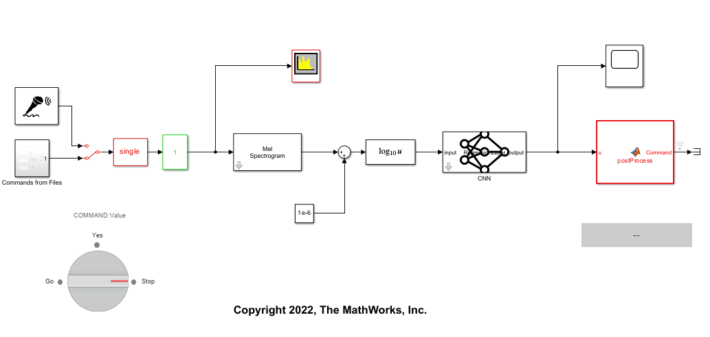

# Use a Python Speech Command Recognition System in MATLAB

## This example shows how to:
- Execute a pretrained Python speech command recognition system in MATLAB.
- Convert the Python system to a MATLAB system where Python is not required.
- Use the MATLAB speech command recognition system in Simulink.
- Generate C code from the MATLAB or Simulink system, and deploy it to a Raspberry Pi device.

## Overview
There are different options for accessing deep learning models trained in non-MATLAB frameworks within MATLAB, including:
- Co-executing models from other frameworks with MATLAB.
- Converting models from other frameworks into MATLAB.
   
This example provides an overview of both approaches using a Python speech command recognition system as a starting point. In addition to a pretrained convolutional network, the system also includes audio feature extraction. You access both the neural network and the feature extraction in MATLAB.

You use the converted command recognition system in both MATLAB and Simulink. You also learn how to generate C code from the system and deploy it to a Raspberry Pi device.

For a MATLAB version of this example, refer to [importAudioAISystem.m](importAudioAISystem.m)

## Requirements
- [MATLAB®](https://www.mathworks.com/) R2021b or later
- [Deep Learning Toolbox™](https://www.mathworks.com/products/deep-learning.html)
- [Audio Toolbox™](https://www.mathworks.com/products/audio.html)

The Python code uses the following packages:
- Librosa™ version 0.8.1
- PyTorch™ version 1.10.2

## System Description
In this example, you start with a deep learning speech command recognition system that was trained in Python. 

The system recognizes the following commands:
- "yes"
- "no"
- "up"
- "down"
- "left"
- "right"
- "on"
- "off"
- "stop"
- "go"

The system is comprised of a convolutional neural network. The network accepts auditory spectrograms as an input. Auditory spectrograms are time-frequency representations of speech. They are derived from the raw (time-domain) audio signal.

For the training workflow, a supervized learning approach is followed, where auditory spectrograms labeled with commands are fed to the network.

The following were used to train the command recognition system:
- PyTorch to design and train the model.
- Librosa to perform feature extraction (auditory spectrogram computation).

You perform speech recognition in Python by first extracting an auditory spectrogram from an audio signal, and then feeding the spectrogram to the trained convolutional network.

## Using the Python System in MATLAB: Two Approaches

You can use the Python system in MATLAB with co-execution. This approach allows you to access variables computed by running Python code in MATLAB, including the predicted speech command, the network activations, and the computed auditory spectrogram. This approach enables you to test the network in MATLAB (for example, by plotting the results, or using them to compute quality metrics implemented in MATLAB).

Co-execution does not address all workflows. For example, if you want to leverage MATLAB's C code generation capabilities to deploy the system to an embedded target, you must first convert the Python system to a MATLAB version. To do this, you translate both feature extraction and the neural network to MATLAB. You then generate code from the MATLAB command recognition system.  

You go through both approaches in the next sections.

## Running The Python Speech Command Recognition System in MATLAB

You can execute Python scripts and commands from MATLAB. For more information about this functionality, see [Call Python from MATLAB](https://www.mathworks.com/help/matlab/call-python-libraries.html) in the documentation. In this example, you use [pyrunfile](https://www.mathworks.com/help/matlab/ref/pyrunfile.html) to run a Python script in MATLAB. The Python script performs command recognition using the pretrained network. pyrunfile allows you to access and use variables from the Python script in MATLAB.

Use pyrunfile to call the Python inference script [InferSpeechCommands.py](PythonCode/InferSpeechCommands.py). Pass the name of the test audio file as an input argument. Return variables computed in the Python script to MATLAB by specifying them as output arguments. In the code snipped below, you return the following:
- The mel spectrogram (computed by Librosa).
- The network activations.
- The parameter-value pairs passed to Librosa's mel spectrogram function.

## Converting the Python Speech Command Recognition System to a MATLAB System

Executing Python code in MATLAB is useful for many workflows, but it is not sufficient for certain scenarios. In this example, you want to leverage MATLAB's code generation abilities to deploy your speech command recognition system to an embedded target. For this task, you need access to a full MATLAB version of the speech command recognition system. 

Recall that the system is comprised of two components (feature extraction and network inference). The following sections explain how to convert each from Python to MATLAB.

### Converting the Network to MATLAB

You first import the PyTorch pretrained network to MATLAB using MATLAB's [model import-export functionality](https://www.mathworks.com/help/deeplearning/deep-learning-import-and-export.html?s_tid=CRUX_lftnav). In this example, you use [importONNXNetwork](https://www.mathworks.com/help/deeplearning/ref/importonnxnetwork.html). The function imports a version of the network that was saved to the Open Neural Network Exchange (ONNX) format. To see how the PyTorch model can be saved to an ONNX format, refer to [convertModelToONNX.py](PythonCode/convertModelToONNX.py).

importONNXNetwork returns a MATLAB object (net) representing the neural network. Feeding the same mel spectrogram to the PyTorch and MATLAB networks yields the same network activations, as shown below.

### Converting Feature Extraction to MATLAB

In the previous section, you used the mel spectrogram computed by Librosa in the Python script.

Now, you translate the Librosa feature extraction to its MATLAB equivalent.

[audioFeatureExtractor](https://www.mathworks.com/help/audio/ref/audiofeatureextractor.html) supports mel spectrogram computations. 

Matching MATLAB and Librosa feature extraction by setting parameter-value pairs of audioFeatureExtractor to their Librosa function equivalent is possible, but it can be a tedious and time-consuming task.

Simplify the process by using the helper function [librosaToAudioToolbox](HelperFiles/librosaToAudioToolbox.m). This function takes the parameter-value pair arguments used in Librosa's mel spectrogram function, and automatically maps them to an equivalent audioFeatureExtractor object.

The function returns code that you can use to compute the auditory spectrograms.

The code produces an identical mel spectrogram as Librosa for the same input signal, as shown below.

## Putting it all Together: Speech Command Recognition in MATLAB

You now have MATLAB versions of the pretrained convolutional network and the feature extraction. You can perform speech command recognition entirely in MATLAB, with no Python dependencies:

## Speech Command Recognition in Simulink

You can perform speech command recognition in Simulink as well.

Use the [predict block](https://www.mathworks.com/help/deeplearning/ref/predict.html) to access the pretrained MATLAB network (net) in Simulink.

Use the [mel Spectrogram block](https://www.mathworks.com/help/audio/ref/melspectrogramblock.html) to extract mel spectrograms from your audio signals in Simulink. Use [librosaToAudioToolbox](HelperFiles/librosaToAudioToolbox.m) to create a mel Spectrogram block that is equivalent to the original Librosa mel spectrogram computation.

Below is a full Simulink implementation of the speech command recognition system (it is included in the repository).

## Speech Command Recognition Code Generation 

The Simulink and MATLAB versions highlighted above both support C code generation and deployment to an embedded target.

For more information on how to deploy the MATLAB version, see the following examples:
- [Speech Command Recognition Code Generation with Intel MKL-DNN](https://www.mathworks.com/help/audio/ug/speech-command-recognition-code-generation-with-intel-mkl-dnn.html).
- [Speech Command Recognition Code Generation on Raspberry Pi](https://www.mathworks.com/help/audio/ug/speech-command-recognition-code-generation-with-raspi.html).

For more information on how to deploy the Simulink version, see the following examples:
- [Speech Command Recognition Code Generation with Intel MKL-DNN Using Simulink](https://www.mathworks.com/help/deeplearning/ug/speech-command-recognition-code-generation-with-intel-mkl-dnn-using-simulink.html).
- [Speech Command Recognition on Raspberry Pi Using Simulink](https://www.mathworks.com/help/deeplearning/ug/speech-command-recognition-on-raspberry-pi-using-simulink.html).
